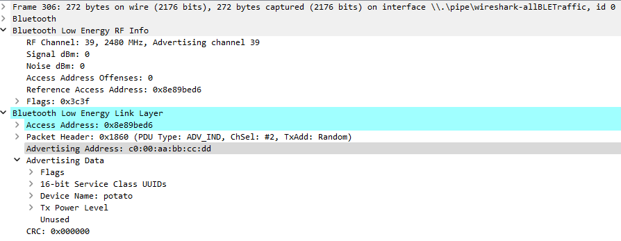
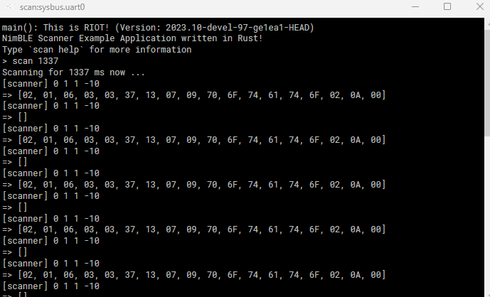

# Examples

RIOT provides a few [examples](https://github.com/RIOT-OS/RIOT/tree/master/examples) for Bluetooth Low Energy using both their Nimble and Skald drivers, but they are written in C.
There are also a few [Rust examples](https://github.com/RIOT-OS/RIOT/tree/master/examples/rust-hello-world).

RIOT's [system for using Rust](https://doc.riot-os.org/using-rust.html) is pretty decent but the [Wrapper Library](https://github.com/RIOT-OS/rust-riot-wrappers) is as of writing this still lacking in quite a lot of aspects, especially when it comes to BLE.
This leads to us having to write wrapper code for the C interface ourselves by mirroring C structures and a lot of `unsafe` sections.

## BLE Advertising

The [Rust BLE Advertising Example](https://github.com/ds-kiel/AreWeIoTYet/tree/main/riot/examples/rust-nimble_advertiser) uses Nimble to send advertisements.

This is what it looks like in renode:

And this is how the advertisement packets that are sent are structured:

## BLE Scanning

The [Rust BLE Scanning Example](https://github.com/ds-kiel/AreWeIoTYet/tree/main/riot/examples/rust-nimble_scanner) registers a `scan` command and when it is entered either with or without a timeout argument it waits that long and prints out the received advertisements.

When running the [`riot_demo`](build.html#riot_demo) this is what the scanner receives:

Here the received arrays are the packets send by the advertiser in raw byte format.
Note here "70 6F 74 61 74 6F" which is the device name of the advertiser.