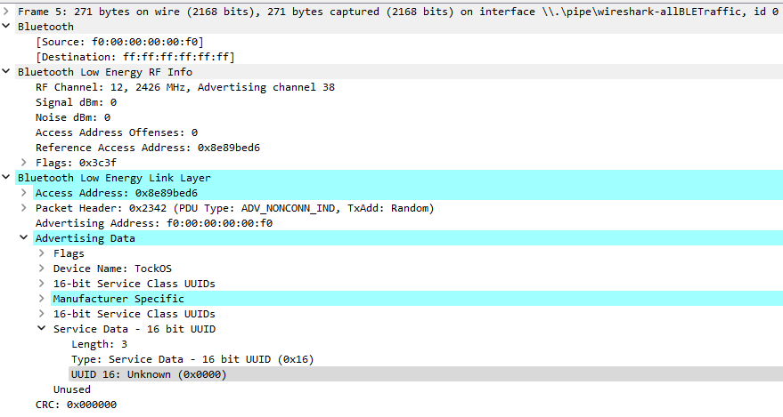

# Build & Run Instructions

When working with [`libtock-rs`](https://github.com/tock/libtock-rs) we are automatically also building `tock` itself.

For building `libtock-rs` we first need [`rustup`](https://rustup.rs/):

- `curl --proto '=https' --tlsv1.2 -sSf https://sh.rustup.rs | sh`

and a few other dependencies:

- `apt-get install git python3 ninja-build pkg-config` (ubuntu:22.04)

We then clone the `libtock-rs` repository recursively to also clone `tock`:

- `git clone --recursive https://github.com/tock/libtock-rs`
    
and inside the `libtock-rs` repository we run the setup:

- `make setup`

Note here that running `make setup` also builds a custom branch of `qemu` which requires some dependencies to be installed.

- `apt-get install libglib2.0-dev libfdt-dev libpixman-1-dev zlib1g-dev libgtk-3-dev` (ubuntu:22.04)

After that our examples need to be copied into the `examples` folder and can be build with:

- `make nrf52840 EXAMPLE=ble_advertising`
- `make nrf52840 EXAMPLE=ble_scanning`
    
As `tock` seperates the kernel and modules, we also need to build the kernel separately:

- `cd libtock-rs/tock/boards/nordic/nrf52840dk && make all`
    

After this we will have the following useful artifacts:

- `libtock-rs/tock/target/thumbv7em-none-eabi/release/nrf52840dk.bin` - `tock` for the `nrf52840dk`
- `libtock-rs/target/thumbv7em-none-eabi/release/examples/ble_advertising.tab` - The Advertising Module
- `libtock-rs/target/thumbv7em-none-eabi/release/examples/ble_scanning.tab` - The Scanning Module
- `libtock-rs/target/thumbv7em-none-eabi/release/examples/ble_advertising.tbf` - The ELF file of the Advertising Module
- `libtock-rs/target/thumbv7em-none-eabi/release/examples/ble_scanning.tbf` - The ELF file of the Scanning Module


## Build with Docker

A `Dockerfile` is additionally provided that when ran will build all these artifacts [here](https://github.com/Pusty/AreWeIoTYet/tree/main/tock/output).

By running `docker build --output=output --target=binaries .` The docker image will be build and the output artifacts will be extracted and put into a folder called `output`.
Note here that the `ble_advertising.elf` / `ble_scanning.elf` are already merged with the kernel and can be directly used with`renode`.

## Run on Device

When wanting to run these examples on actual`nrf52840dk` boards we can follow the [guidelines](https://github.com/tock/tock/blob/master/doc/Getting_Started.md) of tock and [libtock-rs](https://github.com/tock/libtock-rs) which means to build the kernel with `make install` and the examples with `make flash-nrf52840 EXAMPLE=<example>` instead and have the board plugged in over USB.

If we instead want to do this more manual after obtaining the artifacts as above or through `docker` we can instead the kernel with:

- `tockloader flash --address 0x0 --board nrf52840dk --jlink nrf52840dk.bin`

- `tockloader install --board nrf52840dk --jlink ble_advertising`
or 

- `tockloader install --board nrf52840dk --jlink ble_scanning`

This will install the `.tab` files with the respective names on a connected board with `tock` flashed on.
Depending on how the board is connected and the operation system you use some command line options [might need be changed](https://github.com/tock/tockloader).
Note that as of the writing of this, `tockloader` does not support Windows for flashing and installing `tock` and modules, see [here](../setup/hardware.html#working-in-wsl2) on how to use WSL2 for this instead.

## Run on Renode

To run the examples with `tock` in `renode` and preserve all our debug symbols we first need to merge the `tbf` files with the kernel:

- `arm-none-eabi-objcopy --update-section .apps=ble_advertising.tbf nrf52840dk.elf ble_advertising.elf`
- `arm-none-eabi-objcopy --update-section .apps=ble_scanning.tbf nrf52840dk.elf ble_passive_scanning.elf`

The merged ELF files we have can then be directly loaded normally in `renode`.

The examples provide two `renode` scenarios to play around with: `tock_advertise` and `tock_demo`.

### `tock_advertise`

Run with:

- `renode -e "include @tock_advertise.resc;start"`

This starts the advertising example and Wireshark to capture the Bluetooth Low Energy Traffic:




### `tock_demo`

Run with:

- `renode -e "include @tock_demo.resc;start"`

This starts both the advertising and scanning examples.


### Notes on renode:

The modified [`nrf52840-tock.repl`](https://github.com/Pusty/AreWeIoTYet/blob/main/tock/nrf52840-tock.repl) configuration is needed to run `tock` modules in `renode`.

The most notable change is making the following areas of memory writable:

```
regout0: Memory.ArrayMemory @ sysbus 0x10001304
    size: 4
    
pselreset: Memory.ArrayMemory @ sysbus 0x10001200
    size: 8
    
nfcpin: Memory.ArrayMemory @ sysbus 0x1000120C
    size: 4
```

This is because the startup of `tock` for the nrf boards [requires configuring these registers](https://github.com/tock/tock/blob/master/boards/nordic/nrf52_components/src/startup.rs#L41).
If these registers are not writable then `renode` will be stuck in a reboot loop falling constantly to configure the device.

